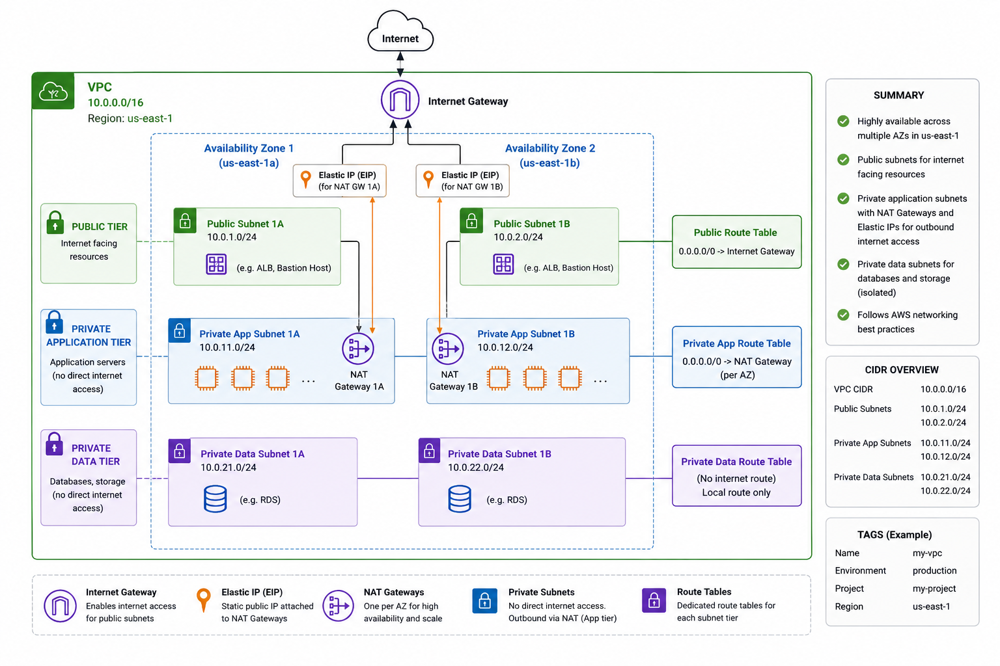

# Terraform AWS VPC Module

## 📐 Project Architecture



# Terraform AWS VPC Module

A reusable Terraform module for provisioning a highly available, production-ready Amazon VPC.

It provisions a VPC spanning multiple Availability Zones with dedicated public, private application, and private data subnets. The networking design includes an Internet Gateway, Elastic IPs, highly available NAT Gateways, and separate route tables to ensure secure communication between network tiers while providing outbound internet access where required.

## Features

The module creates the following AWS networking components:

- Amazon VPC
- Internet Gateway (IGW)
- Elastic IPs (EIPs) for NAT Gateways
- Highly Available NAT Gateways (one per Availability Zone)
- Public Subnets across multiple Availability Zones
- Private Application Subnets across multiple Availability Zones
- Private Data Subnets across multiple Availability Zones
- Public Route Table
- Private Application Route Tables (one per Availability Zone)
- Private Data Route Table
- Route Table Associations for all subnet tiers

## 🏗 Network Design

### 🟢 Public Subnets
- Internet-facing resources (ALB, NAT Gateway, Bastion host)
- Direct route to Internet Gateway

### 🟡 Private Application Subnets
- Application workloads (EC2, ECS, ASG)
- No inbound internet access
- Outbound access via NAT Gateway

### 🔴 Private Data Subnets
- Databases and backend services (RDS, cache)
- Fully isolated from internet access

---

## 🎯 Design Principles

- High Availability (multi-AZ)
- Security through network segmentation
- Scalable and reusable Terraform module
- AWS best practices aligned

---

## 📁 Module Structure

```bash
modules/vpc/
├── versions.tf
├── vpc.tf
├── subnets.tf
├── route_tables.tf
├── internet-gateway.tf
├── variables.tf
└── outputs.tf

This module is intended to be used as the networking foundation for AWS infrastructure such as Application Load Balancers, Auto Scaling Groups, EC2 instances, RDS databases, and other services deployed within a secure multi-tier architecture.